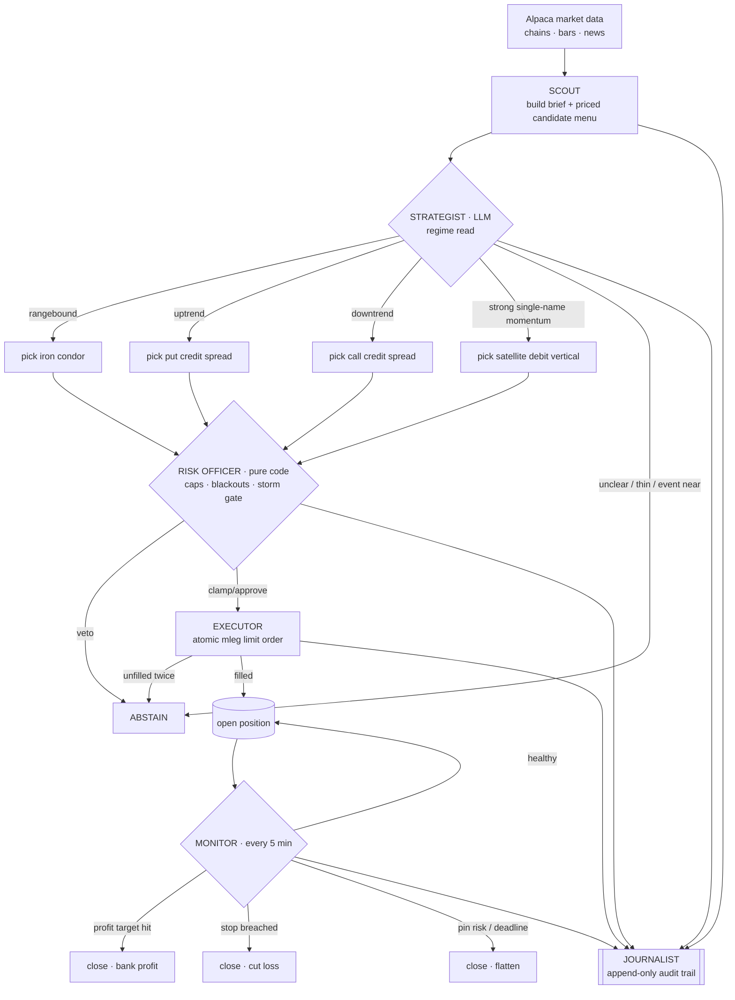

# Visheshak — Defined-Risk Options Trading Agent

An autonomous options-trading agent for Alpaca paper trading. The core idea:
an LLM Strategist reads a machine-built market brief and **selects from
pre-priced candidates or abstains**, while a deterministic Risk Officer with
absolute veto power enforces sizing, exposure caps, event blackouts, and kill
switches. The LLM never invents a strike, a price, or a quantity that code
hasn't already bounded.

Strategy summary (full reasoning in [STRATEGY.md](STRATEGY.md)):
short-dated defined-risk premium selling on index ETFs (SPY/QQQ/IWM/DIA —
put/call credit spreads and iron condors, short strikes ~15–25 delta), plus
at most two small momentum debit spreads on mega-cap names.
A news layer (Alpaca's free Benzinga-powered News API) feeds headlines to the
Strategist for interpretation, while a deterministic "news storm" gate blocks
new entries on any single name printing an unusual headline burst. News is
strictly subtractive — it can veto or shade a decision, never create or
enlarge a position. All positions are force-closed ahead of a configurable
end-of-run deadline.

## The trading approach, explained

### What is an iron condor?

An iron condor is a four-leg options structure that profits when the
underlying **stays inside a range**. You sell one out-of-the-money put spread
below the market and one out-of-the-money call spread above it, collecting a
net credit up front:

```
                 profit
      +credit ────────────────────┐
                 ╱                 ╲
                ╱                   ╲
  ─────────────╱─────────┬───────────╲─────────────▶ price at expiry
              ╱          │            ╲
   max loss ─┘         spot            └─ max loss
             ▲    ▲            ▲    ▲
           long  SHORT       SHORT long
           put    put         call call
          (700)  (705)       (723) (728)     ← the live QQQ condor
```

- **Why it earns:** every day the underlying stays between the short strikes,
  the options you sold lose time value (theta) — value you keep. You win if
  the market goes up a little, down a little, or nowhere.
- **Why it's defined-risk:** the long "wing" legs cap the worst case at
  `width − credit` per share, known before entry. Example from our live book:
  QQQ 705/700 puts + 723/728 calls, $1.31 credit on a $5 width → max loss
  $3.69/share, no matter what the market does.
- **When it's wrong:** in a trending market one side gets run over. That is
  why the playbook only sells condors on a genuinely rangebound underlying
  (5-day move within ±1.5%, price mid-range) — a trending underlying gets a
  one-sided credit spread aligned with the trend instead.

### The playbook, step by step

Every 10 minutes during market hours the agent runs one full decision cycle:

1. **Scout (code) reads the market** — spot, momentum, 5-day range position
   and ATM implied volatility for SPY/QQQ/IWM/DIA plus 9 mega-cap satellites.
2. **Scout builds a priced menu** — from live option chains it constructs
   complete candidate structures (credit spreads, iron condors, momentum
   debit verticals): strikes at 15–25 delta, quotes filtered for width,
   minimum credit enforced, max loss computed. Nothing else is tradable.
3. **Strategist (LLM) reads a brief** — the stats, the menu, a curated news
   digest, and the current risk state — then classifies the regime and maps
   it: uptrend → put credit spread · downtrend → call credit spread ·
   rangebound → iron condor · unclear → abstain. It answers with candidate
   ids only; abstaining is a first-class choice.
4. **Risk Officer (pure code) reviews** — every limit is enforced here:
   1% max loss per structure, 20% total open risk, position and satellite
   caps, no duplicates, macro-event blackouts, news-storm stand-downs, daily
   loss halt, equity kill floor. It can veto or shrink any pick; nothing the
   LLM says can override it.
5. **Executor places atomic multi-leg orders** — all legs in one order at a
   limit price, escalating slightly if unfilled, cancelling and walking away
   rather than chasing.
6. **Monitor (every 5 minutes) manages exits** — take profit at 35% of the
   credit captured (+40% on debit spreads), stop at 1.6× credit (−35% debit),
   close anything hugging a short strike on expiry afternoon, and flatten
   everything before the final deadline.
7. **Journalist records everything** — every brief, rationale, veto, order
   and exit lands in an append-only journal; the dashboard renders it live.

### How the pieces talk — decision flow



Every failure path in that graph resolves to "no trade" or "close position" —
never to an unvalidated trade.

## Architecture

```
            every 10 min (9:45–15:15 ET)
┌──────────┐   brief    ┌────────────┐  JSON picks  ┌──────────────┐
│  SCOUT    │──────────▶│ STRATEGIST │─────────────▶│ RISK OFFICER │
│ Alpaca    │ pre-priced│  LLM (API) │  or abstain  │ pure code,   │
│ data API  │ candidates│            │              │ veto + clamp │
└──────────┘            └────────────┘              └──────┬───────┘
                                                           │ approved qty
      every 5 min                                          ▼
┌──────────────┐  exits: PT/SL/deadline/expiry     ┌──────────────┐
│   MONITOR    │──────────────────────────────────▶│   EXECUTOR   │
│ marks, kill  │                                   │ mleg orders  │
│ switches     │                                   └──────────────┘
└──────────────┘        everything ──▶ JOURNALIST (journal.jsonl + equity_curve.csv)
```

| File | Role |
|---|---|
| `scout.py` | Builds the market brief: spot/momentum stats + fully priced candidate structures from live chains |
| `news.py` | Headline digest for the LLM + deterministic news-storm gate |
| `strategist.py` + `prompts/strategist_system.md` | LLM decision layer; fails safe to abstain |
| `risk_officer.py` | Deterministic guardrails (pure functions, unit-tested) |
| `executor.py` | Multi-leg (mleg) limit orders, fill polling, escalating closes |
| `main.py` | Decision/monitor scheduling, autonomous loop, CLI |
| `chaos_test.py` | Offline failure-injection tests — run before every session |
| `smoke_test.py` | Offline end-to-end decision pass against a synthetic market |
| `config.py` | Every tunable in one place |

### Design principles

- **Separation of powers.** The Scout prices, the Strategist judges, the
  Risk Officer vetoes, the Executor orders. Every rule with a safety
  consequence has a deterministic twin in code; the prompt is never the last
  line of defense.
- **Fail toward flat.** Every failure path degrades to "no trade" or
  "close position" — never to an unvalidated trade. Two LLM parse failures
  in a row means abstain.
- **Journal everything.** Every brief, decision, veto, order, and state
  change is appended to `journal/journal.jsonl`; equity marks go to
  `journal/equity_curve.csv`.

## Risk rules (enforced in code, not in the prompt)

All values live in `config.py`.

| Rule | Value |
|---|---|
| Max loss per structure | 1% of equity |
| Max total open risk | 20% of equity |
| Max open structures / satellites | 10 / 2 |
| Daily loss → no new entries | −2.5% |
| Equity kill floor → flatten + halt | configurable absolute floor |
| Credit exits | take profit at 35% of credit, stop at 1.6× credit |
| Debit exits | take profit at +40%, stop at −35% |
| Event blackouts | no entries 45 min before → 15 min after scheduled macro releases (ISM, JOLTS, claims, NFP, …) |
| Expiry-day rule | from 3:00pm ET, close any credit structure ITM or within 0.3% of its short strike |
| Endgame | no new entries after the configured cutoff; **everything closed by the configured flatten deadline** |

## Setup

1. **Account.** Create an Alpaca paper account and enable options trading at
   **Level 3** in its settings (spreads need it).
2. **Keys.** Copy `.env.example` to `.env`. Fill in the paper account's
   Alpaca keys and a `GEMINI_API_KEY` (aistudio.google.com/apikey).
3. **Install.** `pip install -r requirements.txt` (Python 3.10+).
4. **Prove the guardrails.** `python chaos_test.py` (28 failure-injection
   checks) and `python smoke_test.py` (full offline decision pass) — all
   must pass.
5. **Rehearse.** `python main.py dryrun` runs the whole
   pipeline — data, LLM, risk review — but journals what it *would* open
   instead of ordering. `python main.py once` additionally places real paper
   orders (only meaningful while the market is open; otherwise they queue).

## Running

1. Before the market opens (9:30am ET), start the loop: `python main.py run`
   (keep the machine awake; `nohup python main.py run >> run.log 2>&1 &` on a
   server works too).
2. Watch `journal/journal.jsonl` and `journal/equity_curve.csv`. Useful
   commands: `python main.py status`, `python main.py monitor`,
   `python main.py close-all` (emergency flatten).
3. The agent stops opening new positions at the configured cutoff and
   flattens everything by the configured deadline automatically.

## Dashboard

`python webui.py` serves a live overview at http://127.0.0.1:8501 —
strategy explanation, a board of active trades, portfolio equity, day
P&L, cash and options buying power, all fetched fresh from Alpaca every
15s. The API keys never leave the server process. Set `PORT` to change
the port.

## The journal: an auditable reasoning trail

Every brief, LLM decision, risk verdict, order, and exit is appended to
`journal/journal.jsonl`. Real excerpts from the first live session
(Aug 31 2026) showing the separation of powers working end to end:

The Strategist reads the regime and picks from the pre-priced menu:

```json
{"kind": "strategist", "payload": {"regime": "rangebound",
 "decisions": [{"action": "enter", "candidate_id": "QQQ-ic-2026-09-03",
 "qty": 2, "rationale": "QQQ is trading rangebound with balanced delta
 positioning... capturing a 1.31 credit with a 3.69 max loss per contract"}]}}
```

The Risk Officer independently reviews (and elsewhere clamps or vetoes):

```json
{"kind": "risk_review", "payload": {"candidate": "QQQ-ic-2026-09-03",
 "requested_qty": 2, "approved_qty": 2, "reasons": ["approved"]}}
```

The Executor walks away from bad fills rather than chasing:

```json
{"kind": "open_unfilled", "payload": {"structure":
 "QQQ-iron_condor-2026-09-03-1ecc8b", "attempt": 1, "limit": -1.24}}
```

And after an infrastructure restart, the agent rediscovers its own
positions from the broker instead of trading blind:

```json
{"kind": "state_recovered", "payload": {"reason": "broker positions not in
 local state (fresh disk?)", "structures": ["SPY-iron_condor-2026-09-03-recovered"]}}
```

The dashboard renders the same story live: per-structure P&L (credit
received vs cost to close, buffer to the short strikes) and the equity
curve straight from the journal.

## Implementation notes

- Talks to Alpaca via the **raw Trading API and Market Data API over REST**
  (httpx). No SDKs, official or otherwise.
- Uses the free **indicative** options feed; latest quotes on it are
  real-time. Greeks can be missing on 0DTE contracts, so strike selection
  falls back to %-OTM distance automatically.
- Headlines come from Alpaca's free **News API** (Benzinga content) — same
  keys, no third-party service or scraping.
- Multi-leg orders use `order_class="mleg"` with a **signed** net limit price
  (positive = debit, negative = credit).

## Troubleshooting

- `403` on data endpoints → check the key pair and that `DATA_FEED` is
  `indicative` (OPRA needs a paid subscription).
- Order `rejected` → confirm the paper account's options level is 3 and the
  contract symbols exist (the Scout only uses symbols returned by the chain
  endpoint, so this usually means a key/account mixup).
- Empty candidates in the brief → quotes too wide or credit below minimum;
  see `notes` in the `brief` journal event.
